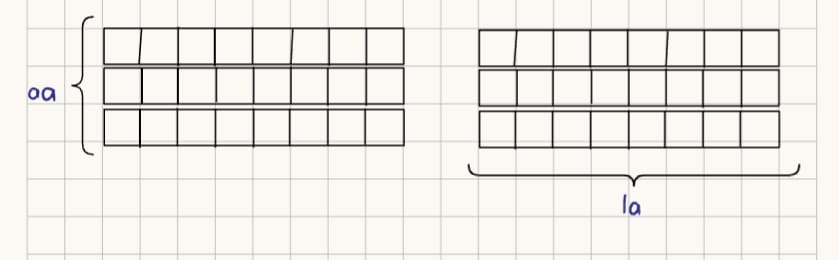

# Ejercicios introducción a la Inteligencia Artifial

## Reinas

El siguiente ejercicio busca acomodar a 4 reinas (piezas del ajedrez) en una matriz de 4 x 4 sin que se ataquen, la forma de acomodarlos sin que se ataquen sería la siguiente:

<table>
<tr>
  <th></th>
  <th></th>
  <th>r</th>
  <th></th>
</tr>
<tr>
  <th>r</th>
  <th></th>
  <th></th>
  <th></th>
</tr>
<tr>
  <th></th>
  <th></th>
  <th></th>
  <th>r</th>
</tr>
<tr>
  <th></th>
  <th>r</th>
  <th></th>
  <th></th>
</tr>
</table>

***

## Problema de Josephus: posición segura 

### Premisas

* Tenemos n cantidad de personas 
* Todos se encuentran en un círculo
* La pocisión de inicio del cuchillo en la primera vueta es aleatoria
* La persona que tenga el cuchillo apuñalará a la persona que tenga enfrente, el cuchillo pasará a la siguiente persona viva
* El ciclo y las rondas se repite hasta que solo queden dos jugadores, uno deberá eliminar al otro y el juego terminará.
* Descubrir el lugar para sobrevivir

***

## Monjes y canivales

Tres monjes y tres cavernicolas se encuentran en una isla, el proposito de esto es cruzar a todas las personas
hhacia la isla siguiente por medio de un bote, las reglas son las siguientes:

1. El bote permite un maximo de dos personas; a su vez, al momento de regrsar de la isla, se necesita minimo de una persona 
para realizar el regreso, sea monje o sea cavernicola
2. En ningunu momento debe haber mas cavernicolas que monjes, ya sea en las islas, dentro del bote o en la sumatoria de estas

### Solucion

<table>
<th>Movimiento</th>
<th>Isla A</th>
<th>Isla B</th>
<th>Sentido</th>
<tr>
<th>0</th>
<th>mmmccc</th>
<th> - </th>
<th>-</th>
</tr>
</tr>
<th>1</th>
<th>mmmc</th>
<th> cc </th>
<th>--></th>
</tr>
</tr>
<th>2</th>
<th>mmmcc</th>
<th> c </th>
<th><--</th>
</tr>
</tr>
<th>3</th>
<th>mmm</th>
<th> ccc </th>
<th>--></th>
</tr>
</tr>
<th>4</th>
<th>mmmc</th>
<th> cc </th>
<th><--</th>
</tr>
</tr>
<th>5</th>
<th>mc</th>
<th> mmcc </th>
<th>--></th>
</tr>
</tr>
<th>6</th>
<th>mmcc</th>
<th> mc </th>
<th><--</th>
</tr>
</tr>
<th>7</th>
<th>cc</th>
<th> mmmc </th>
<th>--></th>
</tr>
</tr>
<th>8</th>
<th>ccc</th>
<th> mmm </th>
<th><--</th>
</tr>
</tr>
<th>9</th>
<th>c</th>
<th> mmmcc </th>
<th>--></th>
</tr>
</tr>
<th>10</th>
<th>cc</th>
<th> mmmc </th>
<th><--</th>
</tr>
</tr>
<th>11</th>
<th>-</th>
<th> mmmccc </th>
<th>--></th>
</tr>
</table>

***

## Laberinto

En una matriz de n x m se crea un laberinto, el punto de inicio y el final
son aleatorios, lo que se busca es crear el algoritmo necesario para poder llegar a la meta:

### Datos conocidos / premisas 

* Arreglo de n x 
* Empezamos en un punto al azar
* Asumiremos que el punto de inicio será un espacio "caminable"
* La salida se encuentra en un punto al azar, al no conocer sus coordenadas, asumiremos que contiene un 1 dentro del recuadro
* Las celdas "caminables" dentro del arreglo serán celdas vacías
* Las celdas que funcionen como pared tendrán una "x" en su interior
* Vamos a colocar un 0 dentro de las celdas en las que estemos, siempre después de verificar que no sean paredes o el final

### Variables iniciales

* `var la`: guardamos dentro de ella el largo del arreglo
* `var aa`: guardaremos dentro de ella el ancho del arreglo
* 'var coordActX': guardamos la coordenada actual en X, también funcionará como coordenada inicial
* `var coordActY`:guardamos la coordenada actual en y, también funcionará como coordenada inicial

### Encontrar la salida

crearemos una función recursiva la cual intentará avanzar en las 4 direcciones hasta encontrar la salida dentro del laberinto, los parámetros serán:

```
function encontrarFinal(cordActY, coordActX)
```

Primero, llenaremos las variables de las dimensiones del arreglo, para esto, consideraremos como 0 el valor mínimo en ambas direcciones, para la variable `la` guardaremos el largo total de un vector dentro del arreglo, para `aa` guardaremos la cantidad de vectores dentro del arreglo.



para la función haremos lo siguiente:

* Usaremos los valores que se enviaron como argumentos dentro de los parámetros para conocer nuestra ubicación actual (la primera vez se introducirán las primeras coordenadas)
* Si nuestra casilla actual tiene un 1, hemos llegado a la meta, colocaremos un `return true` como indicación, si no tiene ningún símbolo podemos tomarla para "caminar"
* Colocamos un 0 en esa casilla, para marcarla como "caminada"
* Por medio de condicionales, programaremos lo siguiente:
  * Podemos avanzar a la derecha si `coordActX` < `la - 1`, en dado caso, mandaremos llamar de nuevo a la función, donde `coordActY` se mantiene igual pero para X mandaremos `coordActX + 1`
  * Podemos avanzar a la izquierda si `coordActX` > 0, en dado caso, mandaremos llamar de nuevo a la función, donde `coordActY` se mantiene igual pero para X mandaremos `coordActX - 1` 
  * Podemos avanzar hacia arriba si `coordActY` > 0, en dado caso, mandaremos llamar de nuevo a la función, donde `coordActX` se mantiene igual pero para Y mandaremos `coordActY - 1`
  * Podemos avanzar hacia abajo si `coordActY` < `aa - 1`, en dado caso, mandaremos llamar de nuevo a la función, donde `coordActX` se mantiene igual pero para Y mandaremos `coordActY + 1`
* Colocaremos un `return true`después de cada uno de los condicionales
* Colocaremos un `return false` al final de la función, para poder ahorrar movimientos si es un 0 o una pared
* Repetiremos el proceso hasta encontrar un 1, podemos hacerlo notar de alguna forma.

### Código de la opción 1

```
const laberinto = [
  [' ', 'x', ' ', ' ', ' ', 'x', ' ', ' '],
  [' ', 'x', ' ', 'x', ' ', ' ', ' ', '1'],
  [' ', ' ', ' ', 'x', 'x', 'x', ' ', 'x']
];

const aa = laberinto.length; 
const la = laberinto[0].length; 

function encontrarFinal(coordActX, coordActY) {
  const celdaActual = laberinto[coordActY][coordActX];

  if (celdaActual === '1') {
    console.log(`\n¡Meta encontrada en X: `, coordActX, `, Y: `, coordActY);
    return true; 
  }

  if (celdaActual === ' ') {
    laberinto[coordActY][coordActX] = '0';

    if (coordActX < la - 1) {
      if (encontrarFinal(coordActX + 1, coordActY)) return true;
    }

    if (coordActX > 0) {
      if (encontrarFinal(coordActX - 1, coordActY)) return true;
    }
    if (coordActY < aa - 1) {
      if (encontrarFinal(coordActX, coordActY + 1)) return true;
    }
    if (coordActY > 0) {
      if (encontrarFinal(coordActX, coordActY - 1)) return true;
    }
  }

  return false;
}

console.log("Laberinto inicial:");
console.table(laberinto);

let exito = encontrarFinal(0, 0);

```


***

## Conteo de islas

En una matriz de n x m se generan diferentes bloques de campos de la matriz juntos, lo cual da el efecto de isla, lograr crear un algoritmo que sea capaz de contar la cantidad de islas de la manera más eficiente posible

### Premisas

* Cada bloque dentro de la matríz estará compuesto por varias o una celda las cuales tendrán un uno como indicador adentro.
* La parte no contable tendrá ceros o en su defecto, celdas vacías.
* Las celdas deben estar compartiendo una arista para considerarse de un mismo conjunto

### Idea general

Recorrer el arreglo de izquierda a derecha empezando por arriba y bajando, cuando nos encontremos con un alguna isla empezaremos con la busqueda completa de la isla, e intercambiando los 1's por algun otro identificador para no volver a pasar por ellos, tendremos un contador que nos permitirá llevar la suma de las islas encontradas, una vez que lleguemos a la ultima celda, habremos terminado.

### Solución detallada

* Iniciaremos declarando una variable, su utilidad será contar la cantidad de islas que nos encontremos.
* Como primer paso, tendremos dos ciclos anidados para permitirnos recorrer todo el arreglo.
* Empezaremos desde la casilla 0,0 avanzando hacia la derecha y, una vez que terminemos con la "fila" completa, comenzaremos con la siguiente desde su posición 0.
* Dentro de los dos ciclos habrá un condicional para verificar si a la celda actual le corresponde un uno, de ser así, empezaremos con la busqueda completa de la isla, si contiene un 0 o una 'v' simplemente seguiremos nuestro camino, para el conteo de las celdas nos ayudaremos de la recursividad:
  * vamos a colocarnos en nuestro primer punto, cambiaremos el uno por una 'v', intentaremos avanzar en las 4 direcciones (siempre respetando los límites del arreglo, evitando caer en celdas de índice -1 o con un número mayor al largo o ancho -1) si seguimos encontrando numeros 1's, los cambiaremos por las v's, al final de la función dejaremos un return para poder salir de la recursividad. 
* Al tener la isla cubierta, podemos continuar con nuestro recorrido, no sin antes actualiza nuestro contador, seguiremos el proceso hasta que no quede más arreglo por recorrer, mostrado después la cantidad guardada por el contador.

### Código de ejemplo

```
function contarIslas(matriz) {
  if (!matriz || matriz.length === 0) return 0;
  const filas = matriz.length;
  const columnas = matriz[0].length;
  let contadorIslas = 0;

  const marcarIsla = (i, j) => {
    if (i < 0 || i >= filas || j < 0 || j >= columnas) {
      return; 
    }
    if (matriz[i][j] !== 1) {
      return;
    }

    matriz[i][j] = 'v';

    marcarIsla(i + 1, j); 
    marcarIsla(i - 1, j); 
    marcarIsla(i, j + 1); 
    marcarIsla(i, j - 1); 
  };

  for (let i = 0; i < filas; i++) {
    for (let j = 0; j < columnas; j++) {
      
      if (matriz[i][j] === 1) {descubierta.
        contadorIslas++;

        marcarIsla(i, j);
      }
    }
  }

  return contadorIslas;
}


const mapa = [
  [1, 1, 0, 0, 0], 
  [1, 1, 0, 0, 1], 
  [0, 0, 0, 1, 1], 
  [0, 0, 0, 0, 0], 
  [1, 0, 1, 0, 1]  
];

const total = contarIslas(mapa);

// Usamos comas para separar el texto de la variable
console.log("Islas encontradas:", total);
```