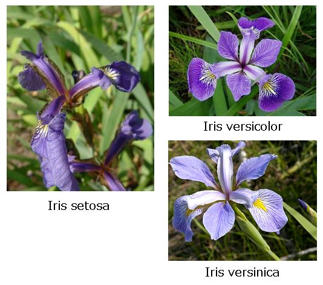

# Ejercicio del dataset

## Datos/relaciones encontradas

* Se encontraron que, los datos se pueden dividir en tres segmentos: del 0 al 50, del 51 al 100 y del 101 al 150 (aproximadamente), ya que en esos números los datos empiezan a cambiar un poco más en relación 
* la relación entre la primera columna con las demás entre el segundo segmento y los otros dos es más cambiante.
* Están acommodados en orden de tamanio, el primer segmento de 50 es el más chico en comparacion con los valores de cada columna
* el valor de la columna D es más continuo dentro de cada segmento, pero muy fluctuante afuera de ellos
* la primera columna tiene valores más grandes que la segunda, esta a su vez valores más gandes que la tercera, y la tercera más que la cuarta.

## Resultado obtennido:

Corresponde al famoso dataset Iris, utilizado frecuentemente para practicar algoritmos de inteligencia artificial y aprendizaje automático.

El dataset contiene medidas de flores del género Iris, pertenecientes a tres especies:

- Iris setosa
- Iris versicolor
- Iris virginica

Se utiliza para entrenar modelos que puedan identificar la especie de una flor a partir de sus características físicas.

